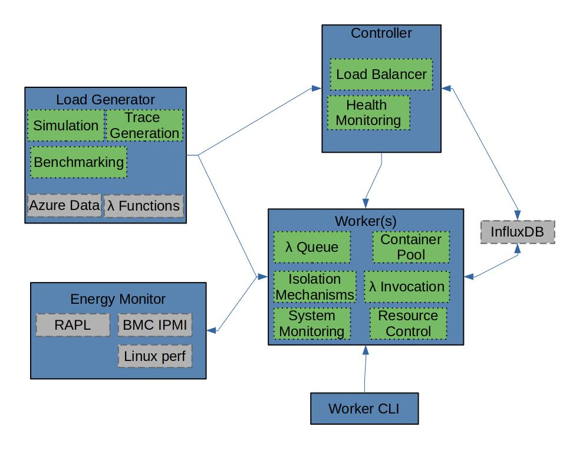

# Design

Ilúvatar is built in three primary parts, a controller, worker, and load generator.
It also includes two secondary pieces, a time series database and a standalone energy monitor.



## Worker

The focus of the Ilúvatar system.
The worker comprises a number of components.

1. **Invocation queue:** all invocations are inserted into this queue before being dispatched to a container. Code for the queuing mechanisms starts [here](../iluvatar_worker_library/src/services/invocation/queueing_dispatcher.rs).
1. **Container pool:** created containers are kept in a pool that ensures containers have memory available. It also performs evictions based on a configurable policy. Code for the queuing mechanisms starts [here](../iluvatar_worker_library/src/services/containers/containermanager.rs).
1. **Isolation mechanisms:** Ilúvatar can use multiple isolation mechanisms and has the easy ability to implement additional ones. Currently, [Docker](../iluvatar_worker_library/src/services/containers/docker/docker.rs) and [Containerd](../iluvatar_worker_library/src/services/containers/containerd/containerd.rs) are supported. New backends must implement the `ContainerT` and `ContainerIsolationService` traits.
1. **Function invocation:** arguments are passed to a container and the function executed inside it. Details can be found [below](#invocation-details).
1. **Resource control:** CPU, GPU, and memory resources can be used by several parts of the system. Components [here](../iluvatar_worker_library/src/services/resources/) ensure that they are never over-allocated unless specified by configuration.
1. **System monitoring:** captured Linux metrics are used by various policies in the worker. This is managed by the [status service](../iluvatar_worker_library/src/services/status/status_service.rs)

Information on running the Ilúvatar worker can be found [here](./WORKER.md).

### Invocation Details

The two isolation mechanisms currently implemented, Docker and Containerd, assume that invocations happen the same way.
They both use the same [OCI](https://opencontainers.org/) images built via Docker.
On boot inside the container, [this web server](../../load/functions/python3/server.py) is started.
It accepts a `POST` call to the `/invoke` endpoint and _requires_ a JSON payload.

Here is an example of using `curl` to call a container:

```bash
curl -X POST -H "Content-Type: application/json" -d "{}" http://localhost:8081/invoke
```

On completion of the invocation, a JSON blob is returned.
This contains fixed information the worker expects to receive from the server, plus any return value from the function code.
The structure of the `ParsedResult` struct can be found [here](../Ilúvatar/iluvatar_worker_library/src/services/containers/structs.rs).

This interaction is controlled by the per-backend implementation.
The Docker example can be found [here](../iluvatar_worker_library/src/services/containers/docker/dockerstructs.rs).
A new backend would not be required to use this invocation handshake, or the current backends could support multiple ways of performing an invocation.
That would just depend on tracking what type of container had been started (i.e. if it uses the web server or another mechanism).

## Controller

The primary component of the controller is to load-balance invocations as they arrive.
There are several [implemented policies](../iluvatar_controller_library/src/services/load_balance/balancers/) for this.
It also pulls worker data from InfluxDB, and monitors worker health to avoid routing to broken workers.
On function registration, the controller is responsible in making sure all workers receive the registration information for functions that will execute on any worker.
Currently, it registers all functions on all workers.

Information on running the Ilúvatar controller can be found [here](./CONTROLLER.md)

## Load Generator

The load generator can direct load at either a single worker or to a controller that sits behind a cluster of workers.
Details about function performance are captured directly and stored on completion of the load being applied.
A number of other vital features are implemented by the load generation framework to make experimentation easier.

1. **System simulation:** run a worker or cluster as a realistic simulation, allowing faster prototyping and exploration of parameter search space.
1. **Trace generation:** creating traces for clusters of different scales, with realistic characteristics mapped from Azure usage data.
1. **Function benchmarking:** capture performance behavior of known functions to use in experiments.

Details on using the load generation framework for both controller and worker can be found [here](./LOAD.md).

## Time series Database

We make use of a third-party time series database, `InfluxDB`, to pool metrics reported by the workers and controller.
This enables online policymaking using information from workers and the controller, without the excessive overhead of communication between all nodes.

## Energy Monitor

The worker has built-in capability to monitor the system energy usage from various sources, [RAPL](https://www.kernel.org/doc/html/latest/power/powercap/powercap.html), [IPMI](https://en.wikipedia.org/wiki/Intelligent_Platform_Management_Interface), and [perf](https://perf.wiki.kernel.org/index.php/Main_Page).
However, there are cases where one wants to capture that information in the same format without running the worker.
The [energy monitor executable](./ENERGY.md) provides that functionality.

## Worker CLI

The CLI is a debugging tool to allow individual commands to be sent to a worker.
It can perform any of the functionality that the load generator or controller can do to a worker, a single command at a time.
Documentation on using the CLI is [here](./CLI.md).
