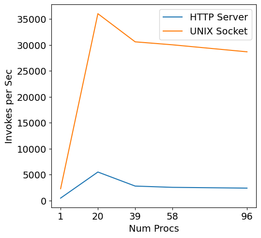

# To-Dos

A list of possible improvements and changes to the base platform.
In no particular order.

## Scaling problem at extreme loads

When forcing the worker to hadle lots of tiny invocations, it hits a scaling problem.
This can be seen by the [server-compare example](../examples/server-compare/README.md).
Figure out what is causing the problem and resolve/mitigate it.

## Simulation Cold Start

The cold start time to create a new container should happen in the sim lifecycle.
More accurate, and allows proper incrementing of system clock when creating a container.

## Improve Ansible interoperability

[This library](https://ansible.readthedocs.io/projects/runner/en/latest/) allows calling `ansible-playbook` via Python code.
Allow calling Ilúvatar Ansible scripts via this interface.
Allow this abstraction to be easily called from external Python code.
Make sure to use `kwargs` to avoid large numbers of function arguments.

## Create Jupyter notebooks for examples

Instead of shell scripts to run examples, do it with Jupyter notebooks.
Can add in graphing & analysis too.

## Monitor GPU utilization on Jetson platform

Jetson requires using `tegrastats` to get utilization numbers.
The [GPU monitor](iluvatar_worker_library/src/services/resources/gpu.rs) needs updated information for ideal usage.
Can cause dispatches to be blocked or broken on Jetson.

## Limit frequency of container checking

Container memory usage _should_ only change during/immediately after it runs an invocation.
There is no need to check a container if it hasn't been used.
Only review a container's memory usage after/during an invocation.

## Reload/clean state on reboot

Currently the worker does not save, load, or recover any state anywhere.
Leftover state can lead to accumulating resource usage, and boot errors from the networking manager.
Clearing this state on startup would enable clean-slate as an assumption.

Or re-loading state would be a general nice feature to have.
Which containers, etc., belong to the worker, the bridge and network veths too.

## Run as Linux daemon

Currently startup on a remote machine via ansible runs the worker and controller as a background ansible job.
This is a hack and not the ideal way to deploy this as software.
Putting this as a linux daemon with the start/stop/restart paradigm would be better.

## Split running and cached memory usage

Container memory usage is reported as one unified number.
We should track and log containers based on them being in-use or cached.

## Monitor background threads for crashes

We start a number of background threads for different reasons.
If any of them crash or panic, it is likely that nothing will be logged, but only go to `stderr`.
It would be nice if we could monitor them for such crashes and log them, possibly even re-starting the thread.

## Reduce `.await` usages

Stacked calls to `await` futures just create more bookkeeping for tokio to manage.
This slowly increases overhead as concurrency rises.
If we can instead return `Future<T>`'s instead of a single `await` call, this will be improved.

## Graceful handling of container exceeding memory

Currently containers get a `limit` of memory usage from the `container_spec` we provide to containerd.
When they hit this limit during an invocation, the python process running that is killed, and the worker sees it as an abrput termination of the HTTP request.
The invocation is declared failed, and the container marked for removal.
We want to remove & replace too-large containers, but not have such failures.
Perhaps use `reservation` or `disableOOMKiller`?
We can handle removal ourselves after an invocation is done.

## Improved Agent Server

If a signal is received by gunicorn, SIGABRT for various errors or SIGKILL for OOM issues, the worker is given an empty response.
Actually returning something would be better, so the worker can handle it more gracefully.

## Improved data & output of load gen

Use something like [polars](https://github.com/pola-rs/polars) to store/compute data from load gen.
Better than hand-parsing / computing data structs and json everywhere.

## Controller optionally return internal data

Currently the controller just returns a function's output to the user.
Have it take an additional paramater to return enhanced data to the user, similar what the worker returns.
TransactionId, code execution time, latencies, etc.

## Generate Ansible variables

Can on-build, the ansible mappings of Iluvatar environment variables to config struct members be done?
Something like `iluvatar_worker` can reference `iluvatar_worker_library` in it's `build.rs`, giving it access to the types.
Can it then generate the ansible vars and put them somewhere?

## Docker-in-Docker Containerd for tests

It would be good if we had some tests that tested live containerd usage.
Currently broken in favor of supporting D-in-D to enable CI tests.

Issues:
    - Can't connect to containers from worker?
    - Container startup may fail because of PID issue -> https://github.com/moby/moby/issues/44335
    - D-in-D Network namespaces are broken with this problem -> https://github.com/containerd/containerd/issues/3667
    - need to clean them up anyway "somehow"

These allow manipulation of netns, but they are corrupted & hard to clean up
`CROSS_CONTAINER_OPTS="--network=host --cap-add CAP_SYS_ADMIN --cap-add NET_ADMIN --security-opt apparmor=unconfined"`

Alternate is to run build inside Cross QEMU system.
But we can't install dependencies inside the VM currently.
Something like this might make it happen: https://github.com/cross-rs/cross/issues/1621

## Optional Memory capping

Currently a container has a limited amount of memory, and under memory pressure _inside_ the container, its processes can be killed by the OS.
Config allowing memory swapping to disk, or removing the isolation enforced memory cap would alleviate this.
The worker can still monitor container memory usage and remove containers if server memory pressure is high.
