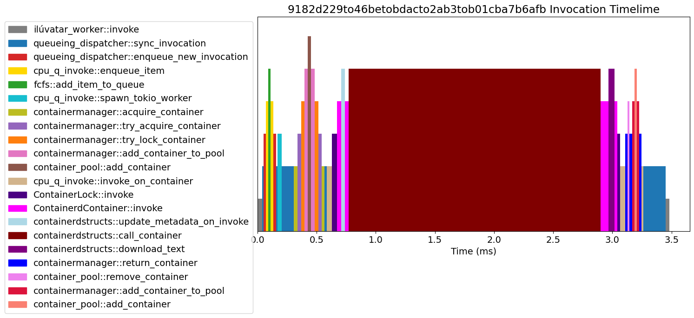

# Detailed Spans

Here we enable the detailed spanning information at compile time, and run several invocations through the worker.
The worker log can then be post-processed to analyze where time is being spent in the worker.

The script [stacked_timelime.py](/stacked_timelime.py) plots a timeline of an invocation as it passed through the worker.
Here is an example of this output:

The longest time is spent waiting in `containerdstructs::call_container` as it makes the HTTP call to the agent running inside the container.
The initial `invoke` and `sync_invocation` functions aren't running concurrently, but are waiting for the invocation to complete.

Make sure you've updated the [host_addresses file](../../../ansible/group_vars/host_addresses.yml) with your machine's networking interface.
Simply execute `./run.sh` to run the example.
