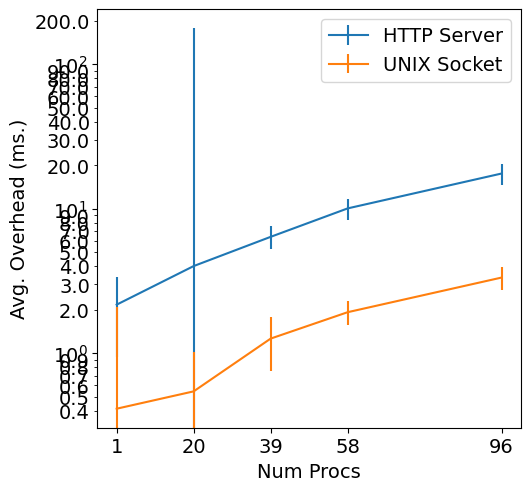

# Server Scaling Compare

This example runs a single specified function against the worker from an increasing number of clients.
It does this by running more threads that connect and issue invocations in a closed-loop manner.

This extends the `scaling` example by comparing two different servers that can run inside each container, which are how the worker connects to them to run invocations.
One is an HTTP server, and the other listens on Unix sockets.

Make sure you've updated the [host_addresses file](../../../ansible/group_vars/host_addresses.yml) with your machine's networking interface.
Simply execute `./run.sh` to run the example.

## Results

This result was run on a 48-core system (96 with hyperthreading).
The number of invocations per second the worker is able to serve increases by over 5x when using Unix socket communication.
Likewise, latency introduced by the worker is similarly reduced, even as the system becomes full.
Results plateau, indiciating that contention is still causing performance degredation at extreme levels.
Note this is using the [`hello`](../../../../load/functions/python3/functions/hello/main.py) function which executes for ~1μs (that's 1/1,000,000th of a second), and not a realistic workload, because sending the RPC from the client to the worker takes more time than running it!
It does, however, strongly tax everything the worker does, and highlight performance differences and problems.

